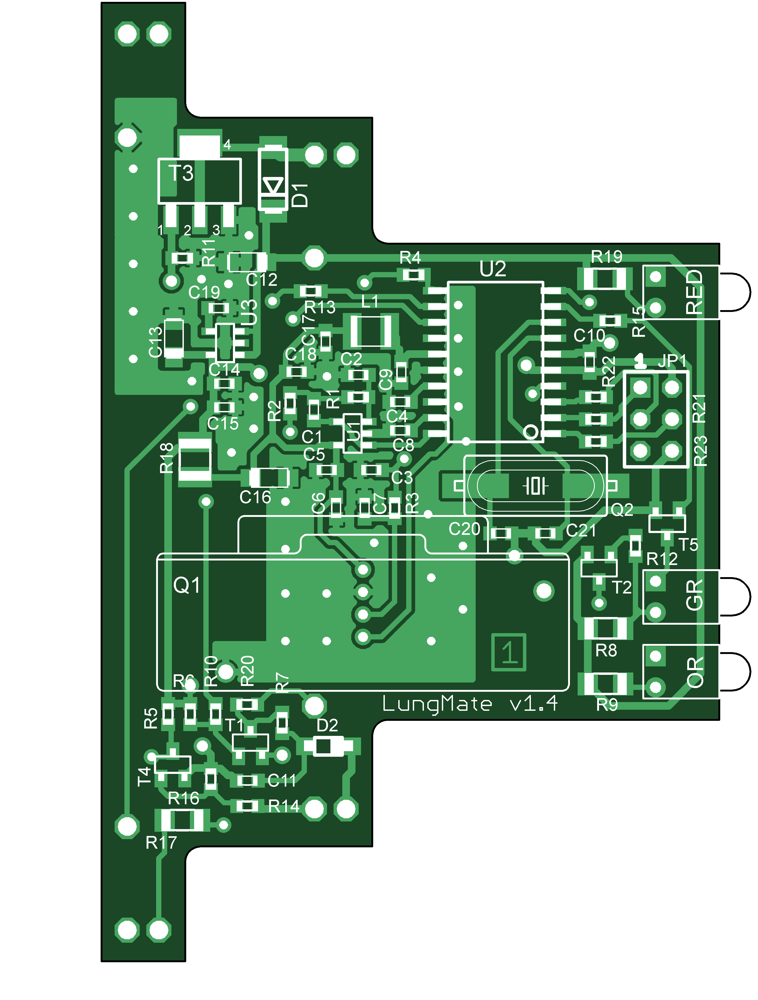

# Dust Extractor Manager for woodworking machinary

Guillaume Arreckx (United Kingdom)

** This was automatically translated from French **

This project should delight carpentry workshop owners who use
woodworking machinary with a chip dust extractor. Thanks to the
'LungMate', you no longer need to worry about the dust extractor,
because it turns on automatically each time you start one of the
machines in the workshop, then turns off once the work is finished. The
assembly is discreet and is placed directly in the workshop's electrical
panel. It precisely measures machine currents via a contactless Hall
effect sensor and transmits the results over a serial interface. It also
allows you to control the dust extractor manually with a simple push
button.

Woodworking machines generate enormous quantities of sawdust and the use
of a chip dust extractor is essential in a workshop. The paradox is that
these dust extractors generate a lot of fine and harmful dust in the
air. They are also noisy and power hungry. They should therefore only be
turned on when necessary. LungMate turns on the chip vacuum each time
one of the woodworking machines starts, then turns it off a few seconds
after the last machine stops, to allow the evacuation of the chips
remaining in the pipes.

Ignition is also slightly delayed; Woodworking machines, which mostly
use induction motors, require a very high starting current.

This delay avoids accumulating the starting currents of the woodworking
machine and the dust extractor, and can thus avoid blowing the pellets!

This implementation is low voltage only and uses a contactless Hall type
current sensor. The power supply and the relay which controls the dust
extractor use standard commercial modules. Ultimately, this achievement
finds its place in a box with the dimensions of the standard circuit
breakers found in modern electrical panels with a 35MM DIN rail. This
assembly is only intended for single-phase machines.

LungMate is also equipped with an RS232 type serial port, which allows
you to configure the module. Incidentally, all power measurements made
are transmitted 5 times per second. Connected to an external system,
this could, for example, make it possible to calculate the cost of the
electricity used...

-   # Plan

Figure 1. LungMate circuit

The assembly is structured around an AVR microcontroller from ATMEL, the
ATtiny861 which operates as conductor. This version of AVR is perfectly
suited for the type of measurement that we carry out here, in particular
thanks to its analog/digital converter which offers a differential mode
and a programmable gain input preamplifier, very useful here.

An external 8.192MHz crystal controls the AVR's internal clock. This
allows precise measurements without having to calibrate the AVR's
internal clock.

A small, standard male HE6 connector allows the microcontroller's flash
memory to be programmed using an SPI programmer for AVRs.
Spindle$$\overline{\text{RESET}}$$is also wired and allows the
connection of Atmel JTAG-ICE or Dragon emulators.

-   # Electronics in detail

Power supply is entrusted to an external module from Lambda, the DSP
10-12.

This switching module is the size of a standard circuit breaker and can
also be mounted on the 35mm rail of the electrical panel.

It provides up to 830mA of continuous and regulated 12V. This is way
more than we need.

The 12V voltage is necessary to drive the external monostable relay.

A small LDO type linear regulator lowers this voltage to 5V to power the
microcontroller and the analog part. This also benefits from additional
filtering by a small RC filter, while the power supply to the
analog/digital converter of the microcontroller is done by a suppression
choke to try to eliminate part of the internal digital noise.

The 3 LEDs are driven directly from 12V using small transistors to avoid
any fluctuation in the 5V power line and distort the measurements.
Ultimately, the current required on the 5V line is very low, with the
majority going to the current sensor.

Control of the dust extractor is entrusted here to a monostable modular
relay from the Italian company Finder. This relay has the following
advantages:

-   A format compatible with electrical panels with 35mm DIN rail
-   A continuous excitation voltage of 12V, with a 115ohm coil
-   A possible charge of 20A

The microcontroller drives it via a Darlington type transistor which
also powers the yellow signaling LED. A diode suppresses the feedback
from the relay coil.

The measured power range is vast! In order to determine when to turn on
the dust extractor, currents of a few hundred mA must be detected. A
small hand sander, for example, may only consume a few tens of Watts,
while at the other extreme, a workshop plane may use several tens of KW,
especially when starting up.

In addition, the module must be able to carry out reliable measurements
if these were to be used at the output of the serial interface.

The Hall sensor from LEM can measure currents up to 150A! With an
optimal range of 50A. The main advantage of this type of sensor is that
the output voltage is proportional and linear to the current passing
through it, with little variation linked to temperature.

The sensor output signal is biased to mid-rail of the power supply. A
small operational amplifier takes this signal and applies a 3rd order
analog anti-overlap filter to it before driving the AVR A/D converter
input. The bias voltage also attacks the microcontroller, which
internally differentiates the two voltages, then amplifies this
difference 8 times.

A few transistors are used here as an RS232 driver, rather than using an
integrated circuit, like the classic MAX232. The RS232 interface uses
±12V signals, although in practice we can be satisfied with ±5V, or even
0-5V over short distances. Here we use a trick, based on the fact that
the exchanges on the port are done alternately, recycling the negative
voltage from the input pin to the output. So only 2 transistors are
needed.

-   # Use

The module can be controlled by 1 or more push buttons to be placed
strategically in the workshop. A closed contact type button, with or
without integrated LED, does the trick. This allows, among other things,
to trigger the dust extractor manually.

In my workshop, the push button is mounted in the chute, next to the end
point of the suction pipe. The LED on the switch reminds you of the
current mode.

The 3 modes are:

1.  AutoThe dust extractor turns on automaticallyThe LED flashes
2.  OnThe dust extractor is onThe LED is on
3.  OffThe dust extractor is offThe LED is off

Figure 2. Mode control button mounted in workshop chute

By default, upon power-up, the mode is Auto.

Depending on whether you press briefly or long, the mode changes
differently:

-   # The software

The software is almost entirely written in C and compiled with the free
tools of the WinAVR suite.

It has several parts:

1.  The main loop, which processes all real-time events, and calculates
    the apparent power.
2.  The machine state which controls remote control and LEDs
3.  The serial console, to change internal parameters, stored in the
    EEPROM

There are several methods of measuring an AC signal. Books on digital
signal processing are full of algorithms of all kinds!

Let us cite, among others, the algorithms of DFT (Discrete Fourier
Transform), FFT (Fast Fourier Transform), and the Goerzel algorithm.

It is also possible to rectify the 50Hz sinusoid using more electronics
and carry out a continuous measurement.

In the end, and despite the use of a small 8-bit microcontroller, the
solution chosen is the fast Fourier transform (FFT) algorithm. The
Fourier transform is an algorithm for converting a time signal into its
different frequency components, the amplitude of which can then be
measured.

This type of algorithm is often used by DSPs, processors specialized in
digital processing and which have specialized instructions for this type
of calculations.

The signal that we are measuring here is relatively slow (50Hz), and
moreover, we are only trying to measure one frequency of the spectrum –
50Hz. All this helps reduce the number of calculations (of Radix-2
Butterfly) and the AVR ultimately achieves this without any problem.

The FFT uses a window of 64 samples with sampling frequency such that
each frequency component or 'bin' has a width of 5Hz. This choice allows
us to measure frequencies of 50Hz or 60Hz (US) without the need for a
Windowing function, such as Hamming.

Each measurement is triggered by an interruption of the AVR's internal
Timer. A burst of 16 conversions into 10-bits is carried out by the ADC
in as short a time as possible.

The microcontroller is in Sleep mode at this time, which reduces
internal noise and improves analog measurement.

These 16 measurements are decimated to ultimately obtain a consolidated
12-bit measurement.

Each new consolidated measurement gives rise to a partial calculation
(1/64th) of the FFT.

At the 64th measurement, the final power is calculated and a new cycle
starts.

In the end, we obtain 5 new results per second. Each result is evaluated
by the automaton which controls the relay and the LEDs, then is
transmitted over the serial link.

The program, once compiled, fills practically the entire 8KB FLASH
memory. The 512 byte RAM is consumed 2/3 just by the FFT buffer.

As for the EEPROM, it stores the configuration parameters which can be
adjusted by connecting the module to a PC via its serial interface.

The AVR watchdog and BOD are continuously activated by setting the AVR
fuses to ensure proper operation. The Watchdog counter is reset to zero
in the main loop so that a hypothetical crash restarts the module. The
'Brown Out Detector' forces a reset if the voltage drops below 4.3V.

-   # The realization

The printed circuit is double-sided with 0.6mm metallized holes, which
are very difficult to produce at home. Another small problem, the
thickness of the IC must not exceed 1.2mm, otherwise, it will not fit
into the notches of the case. I tried with classic FR4 1.6mm, but
nothing, it doesn't work! On the other hand, the FR4 in 1.0mm is very
suitable.

Soldering the components should
not pose too many difficulties for those who are used to soldering SMTs.
You should not be impressed by the small size of the 0603 boxes, they
can be soldered with a conventional iron (small soldering iron required)
or with reflux for the best equipped.

You absolutely need fine tweezers (forget mother-in-law's tweezers!), a
magnifying glass and skillful hands.

The soldering iron method must be accompanied by an additional supply of
flux during welding. Use a flux suitable for CMS, and clean up any
traces at the end - the job looks cleaner on the one hand, and on the
other hand, some fluxes can turn out to be corrosive in the long run.

Figure 3. The circuit with its SMD components

The 0603 packages must be soldered first, followed by the SOT23
transistors, and finally all the SMT components of the flattest or
thickest. Soldering the LEDs and the small connector is done just before
soldering the connection terminals.

The sensor can then be soldered, either directly on the IC, or by
raising it a little with a scrap of FR4 or any other insulator of
approximately 1.5mm thick to align the sensor hole with the face of the
case.

The box connection terminals are soldered directly to the printed
circuit. Everything slides into the grooves in the case provided for
this purpose. You need to drill 3 3mm holes on the front of the box to
pass the LEDs through, and cut out one of the blanks for the sensor. The
workshop's column drill is ideal for drilling the 3 holes. You can use
your gauge to mark the side cut, then make a first rough cut. The final
cut can be made with a cutter along the line of the gauge, because the
wall is relatively thin, but be careful with your fingers!

Figure 4. Cutout required for the box

-   # 

-   # Installation and connections

The LungMate, relay and power supply simply clip onto the panel rail.

But before any final assembly in the table, it is advisable to identify
all the pads of the module, even if it means using a felt-tip pen or a
label maker to mark each pad beforehand.

You must, of course, turn off the power before doing anything on the
board. None of the wires connected to the control module must be 230V –
that would be prohibitive! To facilitate this task, colored wires (other
than the colors already used in the table) with a diameter of 1mm can be
used for all low voltage connections.

For the system to function
correctly, the HAIS sensor must detect the current of all the machines
under monitoring. On the other hand, it should definitely not detect the
current of the dust extractor. Indeed, in automatic mode, once the
woodworking machine is turned off, the current sensor would continue to
detect the load of the dust extractor, and therefore would never turn
off!

In other words, we cannot simply pass the main incoming mains voltage
through the sensor. Detection works just as well with phases as with
neutrals – but especially not both or any mixture, otherwise we would
have made a differential!

Figure 5. Module wiring. All wires are low voltage.

Figure 6. Example of installation in a dedicated panel. Here only one
phase is used.

Figure 7. Example of
installation in a complete table exists. All machines are protected by a
differential block whose neutral return passes through the sensor. The
dust extractor is located on another differential block.

Only machines that you want to trigger suction must have one of their
power supply wires passed through the HAIS sensor. If only one machine
is managed, the phase wire can be passed through the sensor hole. If you
want to manage several machines at the same time, you must pass each
phase of each machine through the sensor. A better solution in this case
consists of grouping all the woodworking machines on a common
differential circuit breaker, and passing the neutral return of this
through the sensor.

Here is the layout diagram of my workshop, which is equipped with 5
power machines controlling the suction. All electrical circuits are
protected by differential circuit breakers, including the control module
and the dust extractor.

Figure 8. A workshop panel
wiring diagram will help an electrician find his way.

Figure 8. The electrical panel
in the workshop with the chip dust extractor.

-   # Module configuration

The module is pre-programmed with a number of standard parameters.

When powered up for the first time, the program reads the EEPROM memory
and calculates a 'checksum'. As this is incorrect, all default
parameters are then written to the EEPROM memory. At the next power-up,
only the EEPROM is valid.

Parameters can be changed by connecting the serial interface of the
module to a PC using any terminal emulator such as HyperTerminal.

Transmission is carried out in 8N1 at 19200 bauds (8Bits, 1 stop bit, no
parity) and no flow control.

Simply press \<Enter\> to activate console mode. In this mode, the
module does not carry out measurements.

|       |                                                        |        |                   |               |
|-------|--------------------------------------------------------|--------|-------------------|---------------|
| Index | Description                                            | Unit   | Type of values    | Default value |
| 1     | Power threshold required to trigger suction            | Watt   | From 50 to 9999   | 50 (Watt)     |
| 2     | Restart in 'Auto' mode                                 | \-     | 0 for no1 for yes | 1 (yes)       |
| 3     | Suction maintenance time once the load has disappeared | Second | From 0 to 99      | 5 (seconds)   |
| 4     | Calibration coefficient                                | \-     | From 1 to 32768   | 3380          |
| 5     | Central frequency to measure                           | Hz     | From 40 to 70     | 50 (Hz)       |

*Figure 9. Summary of configurable parameters in the console*

To change a value, you must enter the index of the value to modify then
\<Enter\>, followed by the new value.

Only valid characters are accepted. An error message is displayed if the
new value is out of norm. The message 'OK' indicates that the new value
has already been programmed.

A '0' exits console mode for measurement mode, and the system then
becomes active again.

If after 8 seconds nothing is typed, the watchdog restarts the module.

-   # List of components

**Resistors (all 0603, unless noted):**

R1 = 42k2 (1%)

R2 = 47k5 (1%)

R3 = 29k4 (1%)

R4, R20, R21, R22, R23 = 270Ω

R5, R10, R12, R13, R14, R15 = 10kΩ

R6, R11, R16 = 100kΩ

R7 = 4k7

R8, R9, R17, R19 = 680Ω (1206 housing)

R18 = 10Ω (1210 case)

**Capacitors (all 0603):**

C10 = 1 - 4.7µF (6.3V minimum)

C7, C19 = 4n7

C2 = 10nF

C20, C21 = 18pF

C4, C6, C8 = 47nF

C3 = 68nF

C1, C5, C9, C11, C14, C17 = 100nF

C15, C18 = 100pF

**Tantalum capacitors:**

C12, C13, C16 = 2µ2 in case A (16V)

**Semiconductors:**

U1 = MCP6001(T) Op-amp in SOT23-5 package or equivalent

U2 = Atmel Attiny861 20SU, SO20 case

U3 = Micrel MIC5205U or compatible

T1,T2 = BC857C

T4,T5 = BC848C

T3 = FZTA14

D1 = GF1A (DO214A)

D2 = BAT54 (SOD123)

LED1 = Red H13X type LED

LED2 = LED type H13X orange

LED3 = Green H13X type LED

**Miscellaneous:**

L1 = 10µH, in 1210 package, such as Murata LQH32CN100K

Q1 = HAIS-50P current sensor from HAIS (Farnell or RS)

Q2 = Quartz 8.192MHz in HC49 case

Relay, Finder 22.21.9.012.4000 (Farnell, 1765071)

Power module, Lambda DSP10-12

Housing, Altech 91.201 (RS, 2508420317)

JP1 = 2x3 pin connector with 2.54mm pitch
